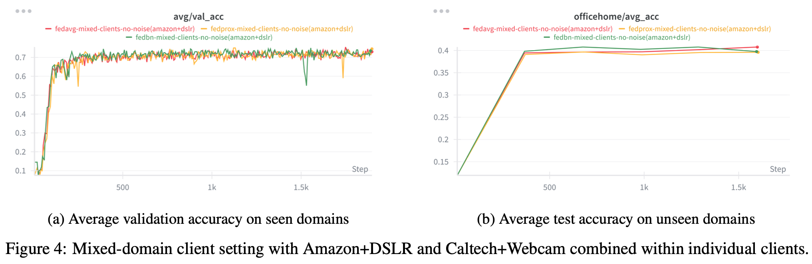
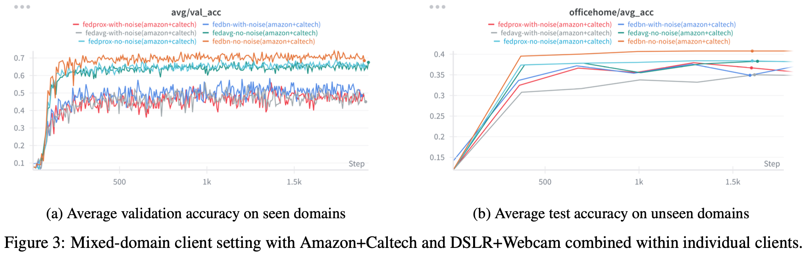
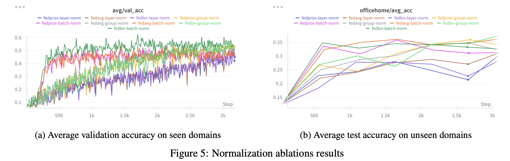

# FedBN: Extended Evaluation under Realistic Federated Conditions


[](./final-report.pdf)

**Extension of:** [FedBN: Federated Learning on Non-IID Features via Local Batch Normalization](https://openreview.net/forum?id=6YEQUn0QICG) (Li et al., ICLR 2021)

**Goal:** Evaluate FedBN's robustness under realistic conditions not covered in the original paper:
- Mixed-domain clients (multiple domains per client)
- Asymmetric client-side noise
- Alternative normalization schemes

**Key Finding:** 

FedBN's advantages degrade when the one-domain-per-client assumption is violated.

---

### Motivation

The original FedBN work demonstrates strong performance under *feature-shift non-IID settings*, assuming:
- One domain per client
- Clean local datasets
- Domain-aligned Batch Normalization statistics

In real-world federated systems, these assumptions are often violated. Clients may:
- Collect data from **multiple domains over time**
- Contain **asymmetric noise** (e.g., label noise, sensor noise)
- Operate under mixed and evolving data distributions

This repository extends the original experiments to examine **when FedBN’s advantages persist and when they degrade**.

---

### Running the Experiments

#### 1. Clone the repository

```bash 
git clone https://github.com/Arpnik/FedBN.git
```


#### 2. Create and activate a new environment

```bash

uv venv .venv
source .venv/bin/activate   # macOS / Linux
```

#### OR
```bash

.venv\Scripts\activate      # Windows
````


#### 3. Install the Project Dependencies
Make sure you run these commands from from folder with pyproject.toml file
```bash

uv pip install -e .
````

#### 4. Datasets

All experiments are conducted using the Office-Caltech and Office-Home benchmarks under different federated learning
configurations.

**office-caltech10**
- Please download our pre-processed datasets [here](https://huggingface.co/datasets/Jemary/FedBN_Dataset/blob/main/office_caltech_10_dataset.zip), put under `data/` directory and perform following commands:
    ```bash
    cd ./data
    unzip office_caltech_10_dataset.zip
    ```

**office-home**
- Please download the Office-Home dataset from [here](https://www.hemanthdv.org/officeHomeDataset.html), put under `data/` directory and ensure the folder is named `OfficeHomeDataset_10072016`.

#### 5. Federated Training

The `--mode` argument specifies the federated learning strategy:
- `fedavg`  — Federated Averaging  
- `fedprox` — Federated Proximal  
- `fedbn`   — Federated Batch Normalization  

Example command to train FedBN on the Office-Caltech benchmark:

```bash
cd federated
python fed_office.py --mode fedbn
```
##### Command-Line Arguments

| Argument | Description | Example |
|--------|------------|---------|
| `--mode` | Federated learning method (`fedavg`, `fedprox`, `fedbn`) | `--mode fedbn` |
| `--norm` | Normalization layer (`bn`, `gn`, `ln`, `none`) | `--norm bn` |
| `--iters` | Number of communication rounds | `--iters 300` |
| `--wk_iters` | Local optimization steps per round | `--wk_iters 1` |
| `--lr` | Learning rate | `--lr 0.01` |
| `--batch` | Batch size | `--batch 32` |

#### Noise Configuration

| Argument | Description | Example |
|--------|------------|---------|
| `--gaussian_std` | Standard deviation of Gaussian input noise | `--gaussian_std 0.5` |
| `--client_noise` | Client-specific noise configuration | `"0:input=0.2,label=0.0;1:input=0.0,label=0.3"` |

> The `--client_noise` flag allows different noise levels to be applied to different clients.

#### Mixed-Domain Client Configuration

In this work, *mixed-domain clients* refer to individual clients whose local datasets contain samples from multiple domains,
introducing **intra-client data heterogeneity** rather than heterogeneity only across clients.

| Argument | Description | Example |
|--------|------------|---------|
| `--client_datasets` | Dataset assignment per client | `"0,1:2:3"` |

Clients are separated by `:` and multiple datasets assigned to the same client are separated by `,`.

Dataset identifiers:
- `0` = Amazon  
- `1` = Caltech  
- `2` = DSLR  
- `3` = Webcam  

This configuration enables evaluation under mixed-domain clients that violate the one-domain-per-client assumption.

---

### Summary of Findings

Our experiments first reproduce the original FedBN results and then systematically extend them to evaluate robustness
under noise, mixed-domain clients, and **generalization to unseen domains** using the Office-Home benchmark.

#### 1. Reproduction of Original FedBN Results

We faithfully reproduce the core results reported in the FedBN paper on the Office-Caltech benchmark, confirming that:
- FedBN outperforms FedAvg and FedProx under clean, single-domain-per-client settings
- Client-specific Batch Normalization effectively mitigates feature shift

This validates the correctness of the implementation and establishes a reliable baseline.

---

#### 2. Robustness Under Asymmetric Client-Side Noise

We introduce heterogeneous noise across clients, including:
- Additive Gaussian input noise
- Label noise with varying intensities

**Key observation:**  
FedBN remains robust when each client corresponds to a single domain, outperforming FedAvg and FedProx on most seen
domains. This indicates that client-specific normalization can stabilize feature distributions even under noisy supervision.

---

#### 3. Mixed-Domain Clients (Violation of One-Domain-Per-Client Assumption)

We evaluate FedBN in settings where individual clients contain data from **multiple domains**, violating a core assumption
of the original method.

**Key observation:**  
FedBN’s advantage consistently degrades under mixed-domain clients. Batch Normalization statistics become entangled
across heterogeneous feature distributions, weakening FedBN’s ability to isolate domain-specific shifts. In these settings,
performance differences between FedBN, FedAvg, and FedProx become marginal or unstable.

This highlights a critical dependency of FedBN on **domain-aligned client partitioning**.





---

#### 4. Normalization Layer Ablation

We further analyze whether FedBN’s gains generalize beyond Batch Normalization by replacing BN with:
- Group Normalization
- Layer Normalization

**Key observation:**  
FedBN’s performance gains are intrinsically tied to Batch Normalization. When BN is replaced, FedBN’s advantage largely
disappears, confirming that its effectiveness relies on preserving client-specific batch statistics rather than normalization
in general.


---

### Key Takeaways

- FedBN is highly effective under **clean, single-domain client settings**
- It remains robust to **asymmetric noise** when domain boundaries are preserved
- Its advantages **break down under mixed-domain clients**, i.e., when heterogeneity is introduced **within individual clients**
- Performance gains do **not generalize to non-batch-based normalization methods**

These findings clarify both the **strengths and limitations** of FedBN and motivate future work on:
- Domain-aware client modeling
- Robust normalization strategies
- Federated methods that explicitly handle intra-client heterogeneity

---

### Future Directions

While this work provides a systematic evaluation of FedBN under more realistic federated settings, several limitations
remain and motivate future research:

- **Limited client heterogeneity modeling**: Mixed-domain clients are constructed using fixed domain mixtures. Future work
  could study *dynamic domain drift*, where client data distributions evolve across communication rounds.


- **Noise–domain interaction not exhaustively explored**: Although noise and domain mixing are evaluated independently,
  their combined effect is not fully characterized. Further experiments could analyze compounding instability arising from
  simultaneous noise and domain shift.


- **Focus on vision benchmarks**: Experiments are limited to standard image-based domain adaptation datasets. Extending
  this analysis to other modalities (e.g., text, speech, medical time-series) would test the generality of the findings.


- **No algorithmic modification proposed**: This work focuses on evaluation rather than proposing a new method. Future
  research could leverage these findings to design hybrid or adaptive normalization schemes that relax the one-domain-per-
  client assumption.

---

### Attribution

This work is an **extension and empirical evaluation** of the original FedBN method.  
All core algorithmic ideas and original contributions belong to:

> Xiaoxiao Li, Meirui Jiang, Xiaofei Zhang, Michael Kamp, Qi Dou  
> *FedBN: Federated Learning on Non-IID Features via Local Batch Normalization*  
> ICLR 2021

This repository aims to complement the original work by exploring **practical robustness and failure modes** under
realistic federated learning settings.
